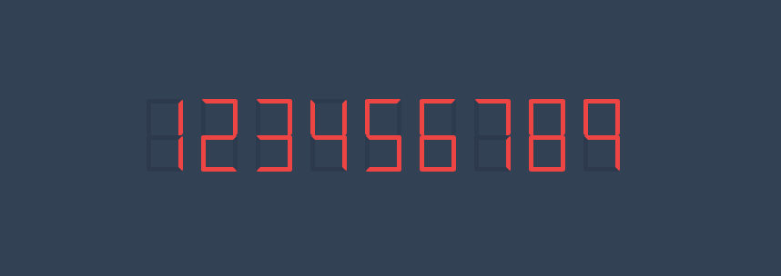
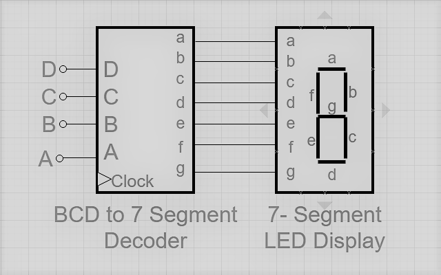
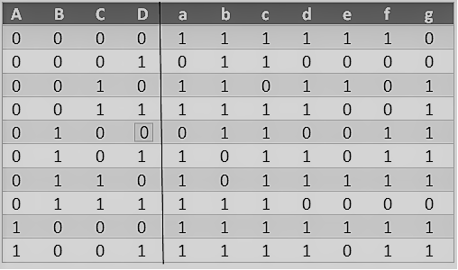

# 7 Segment Display Decoder

````txt
       __        __    __          __    __   __    __    __
      |  |   |   __|   __|  |__|  |__   |__     |  |__|  |__|
      |__|   |  |__    __|     |   __|  |__|    |  |__|     |
    
````

## Before You Start

A clear understanding of Boolean Algebra and/or Electronics is required to get started with implementing a decoder. A decoder is a combinational circuit and so prior knowledge concerning multiplexers, and encoders might be useful.

> I recommend that you read this article on Wikipedia before you proceed;
> [Seven Segment Display](https://en.wikipedia.org/wiki/Seven-segment_display)

## Live Demo

Just to clear the mind, here is a live demo of digital clock

> _Check out this live demo_ [here](https://7segmentdisplaydecoder.netlify.app/)

## Introduction

A **Display Decoder** is a _combinational circuit_ which decodes an _n-bit input value_ into a number of output lines to drive a display. An device which converts one digit format into another is a **Display Decoder Intergrated Circuit** 

One of the most common decoders takes a BCD (Binary Coded Decimal) input and converts it to an 
output which will drive a seven segment display. 

## The Architecture Behind

A seven segment display is made from seven LED (Light Emitting Diodes) segments. These segments are segments `a` through `g` and are lettered clockwise from the top segment of the display with the `g` segment being the middle segment as shown in the figure below;


The seven segment display does not work by directly applying voltage to different segments of LEDs. First, our Decimal number is converted into its BCD equivalent signal then BCD to seven segment decoder converts that signals to the form which is fed to seven segment display.

For the decoder to perform this function has four input lines (A, B, C and D) and 7 output lines (a, b, c, d, e, f and g), this output is given to seven segment LED display which displays the decimal number depending upon inputs.



A truth table generated for this decoder gives:



Using [K-maps](https://www.geeksforgeeks.org/bcd-to-7-segment-decoder/) greatly simplifies the truth table in such a way that a boolean expression for each segment
can be obtained easily.

With boolean expressions for each segment, I implemented the logical display using **HTML and CSS**

## Building Blocks

There only two modules; the [decoder](./src/js/decoder.js) and a [renderer](./src/js/render.js)

> NB: Not Applications should be built with this as it causes performance overheads during rendering.


## Applications

Seven segment displays are used to display digits in;

- calculators
- clocks
- digital watches
- digital counters

>Clubs and theatres event displays are some of the places I normally find these displays being used. The information consists of digits and letters scrolling horizontally. 

# Samples

I only implemented two displays just to be sure;

- [Number Count](./examples/01-number-count/)

- [Digital Clock](./examples/02-digital-clock/)

## References

- [Seven Segment Display](https://en.wikipedia.org/wiki/Seven-segment_display)

- [BCD to 7 Segment Decoder](https://www.geeksforgeeks.org/bcd-to-7-segment-decoder/)
